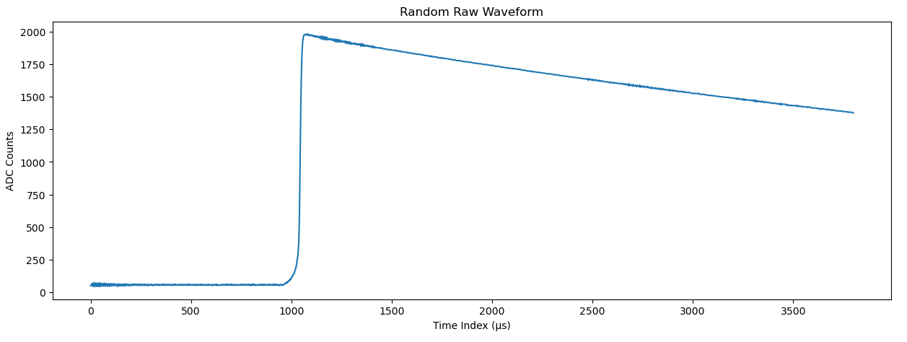

# Finding Ghost Particles
{: .fs-9 }
Advancing energy regression in neutrino research through machine learning-driven waveform analysis.
{: .fs-6 .fw-300 }

[Get started now](#getting-started){: .btn .btn-green .fs-5 .mb-4 .mb-md-0 .mr-2 }
[View it on GitHub][Our repo]{: .btn .btn-purple .fs-5 .mb-4 .mb-md-0 .mr-2 }
[Our report(TBC)][report]{: .btn .btn-primaruy .fs-5 .mb-4 .mb-md-0 }

{: .note }
> The purple button above links to our project repo, click [here] or the link at the top right corner of this page to see the repo for this website.

---
## Introduction

Our Applied Data Science project in NPML(Neutrino Physics Data Science) applies machine learning to analyze time-series data from the Majorana Demonstrator to detect energies in neutrinoless double beta decay by extracting key features and building ML/DL models.
 
## About the Project

The Standard Model suggests neutrinos may be Majorana particles, meaning they are their own antiparticles. This could explain the matter-antimatter asymmetry and their unique mass properties. The Majorana Demonstrator seeks to detect neutrinoless double beta decay, but background interference complicates signal identification.

This project applies machine learning (ML) to analyze [waveform data] from particle detections, improving background rejection. Following NPML guidelines, we develop ML models for event classification and energy reconstruction. By optimizing feature extraction and model selection, this research enhances neutrino detection precision, advancing our understanding of fundamental particle physics.

{: .important }
This website focuses on the regression subgroup of the NPML project. For details on classification, please visit the [classification group's website]().

 
## Overview
Image below is an example of a single waveform, we can extract 13 unique features from it to be used in our models.

 
## Getting started

# Interactive Plot Viewer

Select an image from the dropdown to display different waveform plots.

----

[Our repo]: https://github.com/axie0927/FindingGhostParticles-RegressionSubgroup
[report]: https://github.com/axie0927/FindingGhostParticles-RegressionSubgroup
[here]: https://github.com/zhtdbb1/FindingGhostParticles-Website
[waveform data]: https://zenodo.org/records/8257027