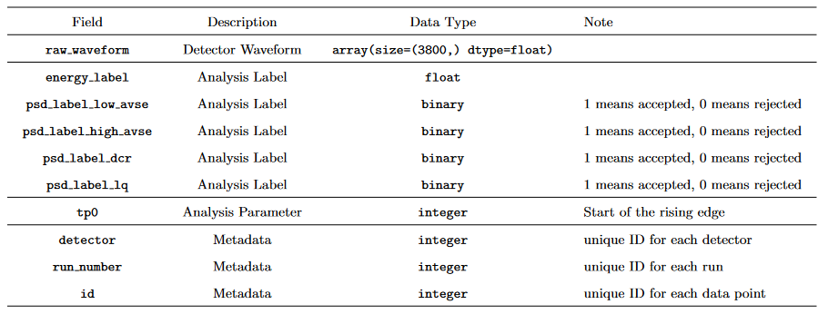
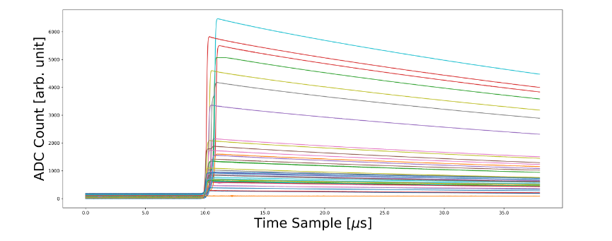
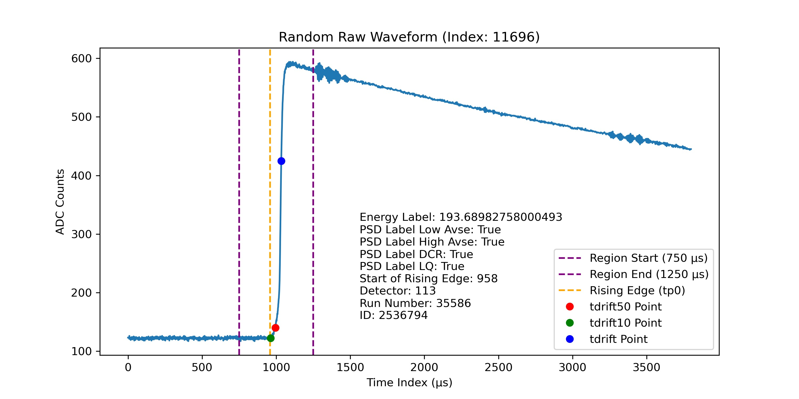

# Finding Ghost Particles
{: .fs-9 }
Advancing energy regression in neutrino research through machine learning-driven waveform analysis.
{: .fs-6 .fw-300 }

[Get started now](#getting-started){: .btn .btn-green .fs-5 .mb-4 .mb-md-0 .mr-2 }
[View it on GitHub][Our repo]{: .btn .btn-purple .fs-5 .mb-4 .mb-md-0 .mr-2 }
[Our report(TBC)][report]{: .btn .btn-primaruy .fs-5 .mb-4 .mb-md-0 }

{: .note }
> The purple button above links to our project repo, click [here] or the link at the top right corner of this page to see the repo for this website.

---
## Introduction

Our Applied Data Science project in **NPML(Neutrino Physics Data Science)** applies machine learning to analyze time-series data from the Majorana Demonstrator to detect energies in neutrinoless double beta decay by extracting key features and building ML/DL models.
 
## About the Project

The Standard Model suggests neutrinos may be Majorana particles, meaning they are their own antiparticles. This could explain the matter-antimatter asymmetry and their unique mass properties. The Majorana Demonstrator seeks to detect neutrinoless double beta decay, but background interference complicates signal identification.

This project applies machine learning (ML) to analyze [waveform data] from particle detections, improving background rejection. Following NPML guidelines, we develop ML models for event classification and energy reconstruction. By optimizing feature extraction and model selection, this research enhances neutrino detection precision, advancing our understanding of fundamental particle physics.

{: .warning }
This website focuses on the regression subgroup of the NPML project. For details on classification, please visit the [classification group's website]().

 
## Overview on data and parameters
This section gives our viewers a quick look on the [data](), [extracted parameters]() and our goal for this project. Please click the link or the sidebar on the left for more details.

[Interactive plot of parameters](#interactive-plot-for-parameters){: .btn .btn-green .fs-5 .mb-4 .mb-md-0 .mr-2 }

### Data 
The processed train, test and NPML datasets contain 1.69M, 300k and 150k observations respectively. Each raw waveform data is feature engineered to extract parameters based on behaviors observed in the waveform.
The dataset looks like this: 

 

### Parameters

The image below is an example of a single waveform, we can extract 13 unique features from it to use in our models. See the [parameters]() section under the data section in the sidebar for more details.

 

### Interactive plot for parameters
The interactive plot below allows you to explore different extracted parameters visually. Use the dropdown menu to switch between plots and observe how each parameter behaves in the waveform analysis. This visualization provides a intuition into the key features that drive our machine learning models in the NPML project.

{: .note }
Not all the parameters can be visualized.

<!-- Dropdown menu to select the image -->
<select id="imageSelector" onchange="updateImage()">
  <option value="assets/images/drift_time.png">Drift Time</option>
  <option value="assets/images/LQ80.png">LQ80 Area</option>
  <option value="assets/images/Area_Growth_Rate.png">Area Growth Rate</option>
  <option value="assets/images/Rising_Edge_Slope.png">Rising Edge Slope</option>
  <option value="assets/images/Rising_Edge_Asymmetry.png">Rising Edge Asymmetry</option>
  <option value="assets/images/Energy_Peak.png">Energy Peak</option>
  <option value="assets/images/Tail_Slope.png">Tail Slope</option>
  <option value="assets/images/Delayed_Charge_Recovery.png">Delayed Charge Recovery</option>
  <option value="assets/images/Fourier_Transformation_and_LFPR.png">Fourier Transformation and LFPR</option>
  <option value="assets/images/Current_amplitude.png">Current Amplitude</option>
</select>

<!-- Display the selected image -->

<!-- JavaScript to switch images based on selection -->

## Models and result

The explanation of our models, conclusions and final result can be found in the left sidebar.
{: .fs-5 .fw-500}

## Getting started

test

----

[Our repo]: https://github.com/axie0927/FindingGhostParticles-RegressionSubgroup
[report]: https://github.com/axie0927/FindingGhostParticles-RegressionSubgroup
[here]: https://github.com/zhtdbb1/FindingGhostParticles-Website
[waveform data]: https://zenodo.org/records/8257027
